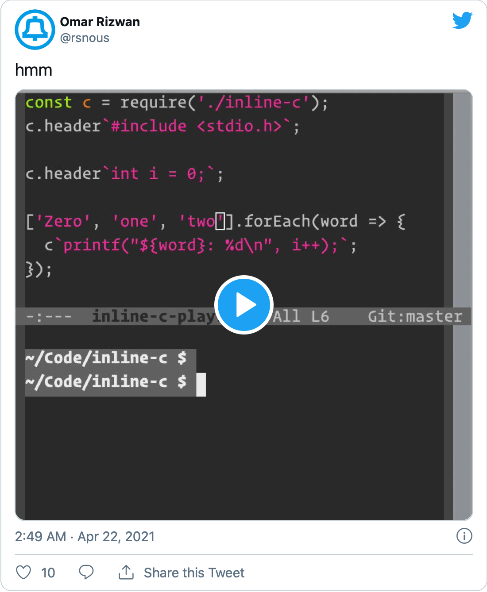

# inline-c-in-nodejs

embed C directly into your Node.js program! 'no FFI'

<a href="https://twitter.com/rsnous/status/1385168967279333376"></a>

(<https://twitter.com/rsnous/status/1385168967279333376>)

[`inline-c-play.js`](inline-c-play.js) has a usage example.

To run (haven't tested recently -- you probably need to `npm install` or
some other stuff):

```
$ node inline-c-play.js
```

- The JS library that implements the `inline-c` module is in
[`inline-c.js`](inline-c.js).

- The C library / Node.js addon that actually calls out to your
computer's C compiler, loads the emitted dynamic library into RAM, and
calls into it is in [`addon.c`](addon.c).

## license

MIT

## notes

I was testing this 'inline C' stuff in Node.js last year out of
curiosity (JS has some nice properties, lots of people know it, how
would it stack up against Tcl or Lua for this?), and recently wanted
to finally put this up to explain to people.

I think the conclusion is, it doesn't stack up great, at least on the
Node platform. The Node FFI is pretty horrible and ugly to work with
-- there are so many files and build things you have to get right, you
can tell just by looking at this repo. It's clearly not a first-class
use for Node.js. You need some dependency to make it remotely clean
and not need C++, etc. ([QuickJS](https://bellard.org/quickjs/) might
be better if you just want the JS language and not the Node/V8
runtime.)

I wrote about this in [newsletter](https://github.com/sponsors/osnr) last year:

> also see:
>
> -   [LuaJIT FFI](https://luajit.org/ext_ffi.html)
> -   [tinycc](https://github.com/TinyCC/tinycc)-based stuff ([node-tinycc](https://github.com/jerch/node-tinycc), [tcltcc](https://wiki.tcl-lang.org/page/tcltcc))
> -   [Zigler](https://github.com/ityonemo/zigler#zig-nifs-made-easy) (via [Quinn Wilton](https://twitter.com/wilton_quinn/status/1385710927534706690))
>
> (we did similar work at Dynamicland to try and get all of that system,
> including the parts that deal with the underlying operating system and
> hardware, into the 'editable layer' of code on the pages)
>
> [another way to think about it](https://twitter.com/rsnous/status/1385704521389670400) is sort of like the TabFS documentation
> stuff. I don't want to be hopping [back and forth](https://twitter.com/rsnous/status/1351319206692868097) between a JS file
> that defines all the behavior, and another JS file that provides all
> the tests, and a Markdown file that provides all the documentation,
> and a C file that provides access to external capabilities. it should
> be [one file](https://twitter.com/rsnous/status/1353420813098131457)! the stuff that I'll want to consult or change at the same
> time should live in the same place, regardless of whether it happens
> to be C code or JavaScript code or prose.
>
> (also reminds me abstractly of [the Footsteps extension](https://twitter.com/Wattenberger/status/1361342759102201860), and of the
> super-lightweight plumb-based 'hyperlinks' in Acme. I think navigation
> remains very underrated as a problem)
>
> (because FFI bindings are work and are extra code to maintain, I
> almost feel like it is an all-or-nothing situation. like, either
> everything is on the JS side, or everything is on the C side. I don't
> want to be constantly setting up ad hoc communications between two
> weirdly shaped halves of the system; I think I want to bring over a
> spanning set of primitives from one side so I can just do everything
> on the other side. like so my bookkeeping -- my data structures for my
> ongoing processes -- can all live in JavaScript from the start, so
> when I want to play with something, I don't have to make up some
> channel on the spot to call back into C to figure out what's going on)

also see
[Critcl](https://andreas-kupries.github.io/critcl/doc/files/critcl_pkg.html#section1)
-- I have
[critcl-pointer-play](https://github.com/osnr/critcl-pointer-play) and
[little-fbdev-critcl-play](https://github.com/osnr/little-fbdev-critcl-play)
as examples I've been playing around w/ more recently

([think about
how](https://twitter.com/rsnous/status/1385365317900144643) the LuaJIT
FFI just has a parser for C declarations built in, how being able to
copy and paste stuff straight from header files is so much more
comfortable than transcribing the types into Scheme or Python or JS or
whatever other weird FFI syntax)
